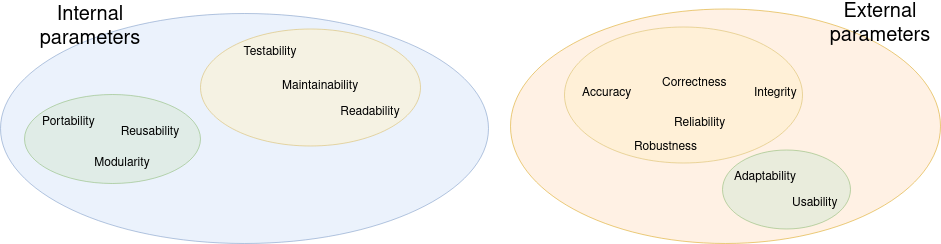

# Executive Summary
This document reports the theoretical and practical aspects of measuring the quality and security of source code produced in the SIFIS-Home project or by third-party developers developing apps expected to run on the SIFIS-Home framework. 

The document is intended to provide a baseline for the definition of secure coding guidelines, which will be reported in D2.3. We will review here the main techniques and formalisms to evaluate the quality and reliability for general software, discussing how these measures are relevant for applications developed for the SIFIS-Home framework, presenting at first general quality metrics and then focusing on security and privacy-related indexes, as they are defined in the literature.

A subset of these metrics will also be used for the mechanisms to evaluate the quality and security of SIFIS-Home applications provided by third-party developers through the tools defined in D2.4.

> **TODO**: Look at the already published deliverables here: 
> 
> https://drive.google.com/drive/folders/1RRwJT16m60ocWaPavfinL4kRQQAjjlB6

# Table of contents

> **TODO**: Fix ToC whenever the sections and subsections of each chapter are deemed stable

[Executive Summary](#executive-summary)

1. [Introduction](#introduction)
2. [Software Quality Assessment](#software-assessment)
    1. [Software Maintainabilty](#software-maintainability)
        1. [Code Quality](#code-quality)
            1. [Bug Detection](#bug-detection)
            2. [Code Sanitization](#code-sanitization)
            3. [Code Coverage](#code-coverage)
        2. [Code Clarity](#code-clarity)
    2. [Tools](#tools)
        1. [Code Quality](#code-quality)
            1. [Bug Detection](#bug-detection)
            2. [Code Sanitization](#code-sanitization)
            3. [Code Coverage](#code-coverage)
        2. [Code Clarity](#code-clarity)
    3. [Alternative Approaches](#alternative-approaches)
3. [Security and Privacy Metrics](#security-and-privacy-metrics)
4. [Privacy and Security Assessment Techniques](#privacy-and-security-assessment-techniques)
6. [Conclusion](#conclusion)
7. [Annex A: Glossary](#annex-a-glossary)
8. [Annex B: Links](#annex-b-links)

# Introduction

Software Engineering has always been devoted to the issue of program quality, which, by definition, is seen as the extent to which a product meets a certain number of expectations concerning both its operation and its internal structure.

A more precise definition of code quality has been illustrated by [@kothapalli2011codeq]: the source code's ability to meet the stated and implied requirements for a given software project.

Software measurement is a process that assesses the manifestation of the size, quantity, amount, or dimension of particular attributes of a software product.

In the literature, parameters have been established against which software quality can be measured or defined. These are divided into two broad categories: _external_ parameters, which refer to how end-users perceive the program, and _internal_ parameters, which refer to how developers perceive software quality.

Internal parameters can be classified as follows:

- Testability: a software is defined as testable if its correctness and reliability properties are easily verifiable, i.e., if it effortlessly reveals its failures. 
- Maintainability: the ability of a program to be modified. These modifications include corrections or adaptations of the system to changes in requirements, environments, and specifications. It includes the properties of Repairability: ease of eliminating defects and _Evolvability_, ease of modifying the program to adapt it to a new environment or improve its quality.
- Reusability: the ability to reuse a piece of software in creating another program, in the case of minor modifications.
- Portability: the ability of the system to run on different hardware and software platforms. This parameter is facilitated by modular design.
- Readability: a software is defined as readable if there is an ease in understanding the reading of the code and its organization and implementation.
- Modularity: useful to measure how many modules a software is composed of. Modules are portions of source code containing instructions written to be reused multiple times in the same program.

External parameters can be classified as follows [@codecomplete2]:

- Correctness: The degree to which a system is free from faults in its specification, design, and implementation.
- Usability: The ease with which users can learn and use a system. Efficiency Minimal use of system resources, including memory and execution time.
- Reliability: The ability of a system to perform its required functions under stated conditions whenever required—having a long mean time between failures.
- Integrity: The degree to which a system prevents unauthorized or improper access to its programs and its data. The idea of integrity includes restricting unauthorized user accesses as well as ensuring that data is accessed properly—that is, that tables with parallel data are modified in parallel, that date fields contain only valid dates, and so on.
- Adaptability: The extent to which a system can be used, without modification, in applications or environments other than those for which it was specifically designed.
- Accuracy: The degree to which a system, as built, is free from error, especially with respect to quantitative outputs. Accuracy differs from correctness; it is a determination of how well a system does the job it’s built for rather than whether it was built correctly.
- Robustness: The degree to which a system continues to function in the presence of invalid inputs or stressful environmental conditions.

In this work, the interest is focused on *internal parameters* since the final goal is strictly related to the developers' point of view and not to the users'. 

The external parameters are strongly related to the internal parameters:

- Correctness, Reliability, Accuracy, Integrity and Robustness are correlated to Testability, Maintainability and Readability.
- Adaptability and Usability are correlated to Modularity and Portability.

One of first the factors that can compromise a program comprehension is code readability. When a source code is hard to read, it is not easy to understand its flow and side effects. Poorly written code leads developers to introduce new bugs while trying to fix old bugs or add new features. Readability measures the effort of the developer to access the information contained in the code, while understandability measures the complexity of such information [@readability]. However, code maintainability is the most critical part of software development. Being highly maintainable is the key to reducing approximately 75% of most systems' life cycle costs.

The _IEEE Standard Glossary of Software Engineering Terminology_ defines software maintainability as the ease with which a software system or component can be modified to correct errors, improve performance or other attributes, or adapt to a changing environment.
 
Furthermore, according to the ISO standard IEC 9126, _software follows the evolution of the organization_, meaning that the program must adapt to all the boundary characteristics present in its development (environment, requirements, functionality).
 
Also, according to the ISO standard IEC 9126, the maintainability of the code has some attributes that completely allow its description:

- Analysability: ability to perform diagnosis on the software and identify the causes of errors and malfunctions.
- Changeability: ability to allow the development of changes to the original software. Implementation includes changes to code, design, and documentation. 
- Stability: ability to avoid unwanted effects as a result of changes to the software.
- Testability: the ability to enable verification and validation of modified software, in other words, to perform testing.
- Maintainability compliance: ability to adhere to standards and conventions related to maintainability.

Software Engineering has dealt extensively with finding applicable models to be able to measure the maintainability of software source code. The purpose of these models is to make this measurement based on changes in the code in different versions of the program to improve the quality of the program.

Over the years, it has been shown that measuring and improving code maintainability is very useful for managing _technical debt_; a definition used to describe all the complications that arise during the development of a software project [@cunningham1992tech]. Besides, another more recent study has shown that analysis and measurement of source code maintainability are still the main methods used for
the management of _technical debt_ [@ernst2015measure]. 

There are many valid models in the literature for measuring source code maintainability:

- The authors of [@aggarwall2002measure] proposed a model based on three main characteristics: code readability (RSC), documentation quality (DOQ), and software understandability (UOS). The measures that are computed are transformed into _fuzzy_ values, which will be processed and retransformed by domain experts.
- [@antonellis2007measure] started from the characteristics of the ISO/IEC 9126 standard to propose a model for mapping _object-oriented_ metrics in order to evaluate and measure the maintainability of a software system. This method has been applied to an OSS-type software, demonstrating the possibility to measure code maintainability through a systematic process.
- SIG Maintainability Model (SIG-MM): this model involves linking system-level maintainability characteristics with code-level measures in two steps. In the first pass, system-level characteristics are mapped to source code-level properties. In the second, one or more source code measures are determined for each property [@heitlager2007sigmm].
- A probabilistic approach was adopted by [@bakota2011prob] for high-level computing features by integrating expert knowledge while addressing ambiguity. The value of code maintainability is viewed as a probability distribution.
- SQUALE: this method is based on _Indices_, representing costs for evaluating various aspects of source code quality. There are two different models in the method: the _Quality Model_ used to formulate and organize the non-functional requirements related to code quality, and the _Analysis Model_ which contains both the rules that are used to normalize the measures and violations related to the code and the rules for aggregating the normalized values [@letouzey2012sqale].
- QUAMOCO: This approach involves the development of a meta-model for software quality that starts from structuring quality-related concepts to defining the operational methods for assessing its fulfillment in a specific environment. Also, an evaluation method is provided to integrate with the previous meta-model. This approach is used for integrating the abstract quality definitions provided in the quality taxonomies with concrete software quality assessment and measurement techniques [@wagner2012quamoco].
- [@bauer2012framework] proposed an alternative approach to the others analyzed so far, which involves using a framework that fits the needs of incremental quality and maintainability checks on the source code. This allows the incremental and distributed computation of quality metrics useful for software quality assessment and measurement, including both local and global metrics in the calculations.
- Delta Maintainability Model (DMM): this model measures the maintainability of a code change as a ratio of low-risk code to overall modified code. It also identifies source code risk factors by reusing software metrics and risk profiles from the SIG-MM, applying new aggregation and scoring for software delta metrics at the level of fine-grained code changes, such as commits or pull requests, instead of aggregating at the system level [@dibiase2019dmm].

Software quality management is becoming a topic of absolute necessity as systems over the years are evolving in complexity and size. Using effective programs or tools to maintain them is critical for developers during the software lifecycle.

There are several types of tools in the literature that can be used to improve software quality [@krishnan2007codetools]:

- Static Analysis Tools: are useful for examining problems based on code analysis, such as the use of uninitialized variables, the possibility of memory leaks, dereferencing of null pointers.
- UT Tools: allows performing _Unit Testing_ of the source code.
- Memory Leak Detection Tools: detect possible memory leaks at runtime.
- Code Browsing/Reverse Engineering Tools: help with code understanding so that improvements and troubleshooting can be applied appropriately.
- Profiling Tools: help understand and monitor performance aspects of the code.
- Coverage Tools: highlight which test cases cover parts of the code run to ensure test quality.

Software Quality is an aspect that has fundamental importance within the SIFIS-Home project together with Security and Privacy. 

SIFIS-Home will provide developers with software verification and evaluation tools to assess and communicate the overall quality of source code and produced applications to end-users in a user-friendly way. 

> **TODO** -> pointer on security and privacy metrics

Through these mechanisms, the SIFIS-Home project pushes developers to implement applications according to their best security and quality criteria, so building over time a reputation score aimed at winning end-user trust.

This document is organized as follows: 

- Section 2 provides detailed information about the software quality assessment techniques and models to evaluate the quality of an IoT software;
- Section 3 describes security and privacy metrics that can be used for assessing the IoT software developed by third-party developers;
- Section 4 discusses privacy and security assessment techniques;
- Section 5 concludes the deliverable and lists the prosecution of this work within the SIFIS-Home project.

