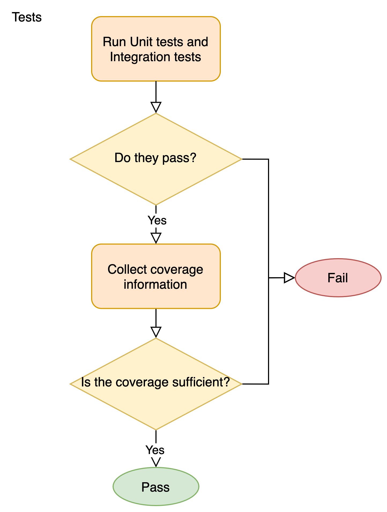

# Software Quality Guidelines

In this part of the document we propose some guidelines that a developer is **strongly** recommended to consider for software development, and consequently, software quality evaluation.

The guidelines will be structured as a workflow that describes step-by-step the procedures and methods a developer **should** follow to produce a software of good quality.

Regarding software quality instead, in deliverable 2.1 we have identified a series of different metrics to evaluate a software. All of them are part of a software engineering branch called *Software Maintainability* and below we present the ones which we consider notable from a developer perspective:

* *Static analysis*: analyzes the source code with the purpose of finding defects and providing some information to improve code quality.
* *Dynamic analysis*: analyzes a running software with the purpose of finding possible memory faults and security issues. In addition, it also detects the parts of a program that can be further optimized. 
* *Code coverage*: determines the percentage of source code covered by the test suite.

For what concerns the arguments treated in this section, we start presenting the workflow structure followed by a practical workflow example based on the notorious *C* language.

Subsequently, we illustrate some notions about software quality from a developer perspective and a possible definition for a stamp.

In the last part instead, we will provide some additional notes about the *Rust* language, since it tries to solve by construction some of the defects pointed out by metrics, and some information on the *reproducibility* of the results obtained during the workflow steps.

We would like to specify that those guidelines are thought **only** for developers, so they are not aimed neither at system integrators nor at software distributors, even though it is possible to find  within the various subsections some information about software packaging and how to write tests for the final binary.

## Workflow Structure

Multiple tool may fit the same role within a good workflow, this chapter just suggests the phases and does not mention specific software, for a specific example scenario please refer to [Example C Workflow][].

### Main components

The workflow assumes a single project exists, with its **Build System**, it has a **Continuous Integration** setup and that includes a **Continuous Delivery** phase.

### Lifecycle

The workflow assumes that the software is developed using the **Pull Request** model:

* A patcheset is prepared, containing features and fixes and tests covering the code changes.
* The patchset is put in **review**
* The continuous integration automation will run a set of **fast static analysis**, as a rule of thumb this phase should be at least twice as fast as building the project:
    * Coding style checks
    * Code Quality Analysis
* If the phase passes then the CI will run increasingly more resource intensive tasks:
    * Compile tests
    * Static Fault Analysis
    * Unit tests
    * Integration tests
    * Code coverage evaluation
    * Dynamic Fault Analysis
* Once those phases pass and it is possible to prepare packages and ensure that the software would be ready for distribution.
* If all those phases passes and the **reviewers** approve the changes, the patchset is merged.


### Phases in detail
The workflow should try to minimize the developer wait time. As soon as a mistake is detected it should be reported. 

When possible most the fast tests should be run by the developer while writing the software.

Ideally all the checks should be integrated in the **build system**, making it more practical to execute locally every test when the need arises.

#### Fast static analysis
The fast static analysis is meant to enforce a level of uniformity through the linters and to provide a quick overview of the project state.

The code quality metrics execute quickly and their output can help the developer and the reviewer by highlighting the part of the code that have higher complexity and thus require more documentation and additional tests.


#### Compile test
Making sure the code builds for all the supported targets is important even if you are not going to run tests on all of them.

Setting up and keep operational a full test environment for many architectures can be cumbersome, having a cross-building setup is a good compromise.

If the code stops compiling on an architecture the problem has to be solved as soon as possible.


#### Unit and Integration testing
Proper **unit** and **integration** tests make sure that the behavior of the software is correct.

A single unit test is quick to write and usually quick to execute, but it adds up quickly and completing the unit test suite may require some time and resources.

Integration tests may be more cumbersome in general but they consider a bigger picture and catch mistakes unit tests cannot easily detect.

In general the tests should **cover** as much of the codebase as possible.



##### Coverage analysis
In order to measure how much of the code the tests cover some tools can be used for the purpose.

Some require *instrumenting specifically* the build, adding another **compilation** phase.

Other use non-intrusive profiling to get less precise data at a fraction of the time.

It is possible to use the code complexity/quality map together with the code coverage map to decide which area of the code should be prioritized and to decide when the coverage is adequate. 

If a new feature is introduced without enough tests covering it this phase would be able tell.

Any pull request reducing the code coverage below a set threshold should be rejected.

#### Static probable fault analysis
This kind of static analysis usually is as slow or few times slower than building the software by a normal compiler.

For many languages the compiler suite itself may include the capability.

The static analyzers can detect a good number of mistakes that could be overlooked on review and it is usually still faster than the phases coming later.

Depending on the tool it can detect simple `use-after-free` or `null-dereferences` or actual API misuse such as [locking faults using pthreads](https://clang.llvm.org/docs/analyzer/checkers.html#alpha-unix-pthreadlock).


#### Dynamic fault detection
The tools available to dynamically detect faults in the code can be split in two groups:
- Those that require custom build and instrumentation
- Those that rely on the non-intrusive profiling features provided by the platform

This class of tools tend to execute between two times and tenfold times slower than a normal debug build.

They may be coupled with fuzzing technologies to detect faults and expand the code coverage, this activity should not happen on a per-pull request basis since it is extremely onerous.

The tools in this class tend to not have many false positive. When they do it is usually caused by a miscompilation or due limitations in their cpu/memory models.

The tools in this group can easily find faults caused by unexpected interactions with external APIs that the static fault analysis cannot detect.


#### Packaging checks

The codebase should be ready to ship anytime, the best way to ensure it is to automate the package creation.

Some packages do require some form of digital signature and may add additional obfuscation to the build.

Depending on how onerous the process it, it may run per pull-request or as a daily/weekly basis.

Since code-signing in itself can be a security concern separated signing keys could be used when possible.

## Example Workflow - C

The C language does not have a standard build system.

On Windows traditionally what comes with the IDE of choice is used.

On unix-like platforms, traditionally the Posix Make and its [gnu dialect](https://www.gnu.org/software/make/) with some *configure* helper script were the most widely used setup.

macOS has a mix of the two, with XCode and the unix-way coexisting.

Nowadays [ninja](https://ninja-build.org/) is making strides, popularized by [cmake](https://cmake.org/) and [meson](https://mesonbuild.com/). With the latter two replacing the traditional *configure* script.

For this example we'll use [meson](https://mesonbuild.com), since it provides a good, yet minimalistic, [test integration](https://mesonbuild.com/Unit-tests.html) that includes support for test coverage out of box.

[cmake](https://cmake.org/)'s [testing support](https://cmake.org/cmake/help/latest/manual/ctest.1.html) is more complex and richer, but that makes it less suited for an example.

### Tests

The C language does not have a built-in concept of Unit Test, there are a number of third-party libraries to automate part of the process and have a standardized output. 

The tests can be built as a normal meson [`executable()`](https://mesonbuild.com/Reference-manual.html#executable) targets. and [`test()`](https://mesonbuild.com/Reference-manual.html#test) let you run a test executable, parse its output and report the result.

``` meson
e = executable('prog', 'testprog.c')
test('name of test', e)
```

### Linting
A good style linter for C, among the others, is `clang-format`.

**meson** integrates with it [out of box](https://mesonbuild.com/Code-formatting.html).


#### Code Quality Metrics
[rust-code-analysis](https://crates.io/crates/rust-code-analysis) provides a good report, but it is not integrated directly with meson. Calling the `rust-code-analysis-cli` passing the source root directory is enough to get the information.

The metrics provided can guide the developer so objectively more complex code can be tested thoroughly. 

Depending on the project, it is possible to consider blocking a patch introducing too much complexity automatically.

During T2.2 better integration with the build system and the code-coverage evaluation will be explored.

#### Coverage
Meson integrates with [gcovr](https://gcovr.com/en/stable/). As [explained](https://mesonbuild.com/howtox.html#producing-a-coverage-report) in the manual `-Db_coverage=true` is a shorthand to instrument the build and then

```
$ meson compile
$ meson test
$ meson compile coverage # or coverage-text, coverage-xml
```

The generated xml file can be parsed to implement CI blockers if the code coverage is not adequate.

Having good code-coverage report is paramount and setting a patch blocker that prevents reducing the test coverage ensures that all the analysis on the test corpus stays meaningful.

### Probable Fault Analysis
It is possible to detect probable faults in the code by automatic means thanks to static and dynamic analysis tools.

Running the tests under those tool takes between 2x and 10x the normal execution of a debug build.

#### Static Analysis
meson [integrates](https://mesonbuild.com/howtox.html#use-clang-static-analyzer) with [clang-analyzer](https://clang-analyzer.llvm.org/) `scan-build` and it has some partial support for [clang-tidy](https://clang.llvm.org/extra/clang-tidy/). 

Any tool that can consume the [compile_commands.json](https://clang.llvm.org/docs/JSONCompilationDatabase.html) can be used with success.

#### Dynamic Analysis
The analysis tools that work on non-instrumented binaries can use the `--wrap` option for the test runner:
```
$ meson test --wrap=valgrind testname
```

meson support the sanitize family of tooling available with GCC and Clang out of box through the `-Db_sanitize=` option, e.g. to use [AddressSanitizer](https://clang.llvm.org/docs/AddressSanitizer.html)
```
$ meson <other options> -Db_sanitize=address
$ meson test <other options> <testname>
```

### Packaging

Meson has a minimal [built-in support](https://mesonbuild.com/RPM-module.html) to generate [RPM specfiles](https://rpm-packaging-guide.github.io/), but no built-ins for other common targets.

During T2.2 we will evaluate strategies to automate package creation for common distributions.


## Software Quality

Software quality defines a series of methods to evaluate the quality of a software and provides some information on the safety, security, reliability, and maintainability of a codebase.

The data produced by those methods are usually metrics that can be computed either analyzing the code of a program or its execution flow.

During the description of the sections, we recommend some programs for computing metrics. This is not an *imposition*, but **only** a recommendation, in fact a developer **should** follow the steps defined in the workflow presented above, but the choice of the software to be used is at discretion of a developer.

### Static analysis

Static code analysis analyzes the code of a software to evaluate its quality and detect its faults before a program is being run. 

#### Code quality

*Code quality* provides a set of metrics that establish the quality of a code through the verification of some properties.

One property is *verbosity*. A verbose code could take a long time to be read and comprehended, wasting a lot of mental energy. It is usually considered in terms of the number of code lines in a source file.

SLOC
: Source Lines of Code. It returns the total number of lines in a file.

PLOC
: Physical Lines of Code. It returns the number of instructions and comment lines in a file.

LLOC
: Logical Lines of Code. It returns the number of logical lines (statements) in a file.

CLOC
: Comment Lines of Code. It returns the number of comment lines in a file.

BLANK
: Blank Lines of Code. It returns the number of blank lines in a file.

Reducing *SLOC*, *PLOC*, and *LLOC* metrics through refactors guarantees a less verbose code, which results in a simpler and faster understandability of a codebase, while an higher value for *CLOC* indicates good documentation and clarity in the most difficult parts of a code.

Another property is the *structure* of a code. So the functions and closures that compose a codebase are analyzed to evaluate their lengths, number of arguments, and in case of functions, the number of exit points.

NOM
: Number of Methods. It counts the number of methods in a file.

NARGS
: Number of Arguments. It counts the number of arguments of each method in a file.

NEXITS
: Number of Exit Points. It counts the number of exit points of each method in a file.

*NARGS* and *NEXITS* are intuitively linked with the easiness in reading and interpreting a source code: a function with a high number of arguments can be more difficult to analyze because of the higher number of possible paths, while a function with many exit points may be problematic in reading the code.

For metrics computation, we recommend an open-source tool developed by Mozilla [@rca], called *rust-code-analysis*, because it is fast on large codebases and covers some of the most notorious programming languages.

#### Code complexity

*Code complexity* determines the complexity of maintaining a code over a long period of time. So those kind of metrics provides some information about the difficulty to understand at first glance the control flow of a program, or the effort to manage a codebase, or even an estimate on the ease of introducing bugs and errors in a code.

As explained in more detail in Deliverable 2.1, three are the most known metrics created for these purposes:

* *Cyclomatic Complexity*: it measures the complexity of a method’s control flow. It was originally intended to identify software modules that will be difficult to test or maintain [@cyclomatic]
* *Cognitive Complexity*: it evaluates the control flow of a code through mathematical models that reflect programmers’ intuitions about the mental, or *cognitive* effort required to understand those flows [@campbell]
* *Halstead Suite*: After having retrieved every operands and operators present in a code, it computes a set of quantitative complexity measures that quantify, for example, the effort to manage a codebase of a determined size and volume, or an estimate on the ease of introducing bugs and errors in a code.

As for the code quality metrics, we recommend the use of *rust-code-analysis* for their computation.

### Dynamic analysis

With dynamic analysis (or dynamic code analysis), a developer analyzes a computer software by running the program. The goal is to find errors in a program while it is executed instead of examining the code offline. This process is the opposite of static analysis.

Dynamic analysis can spot: lack of code coverage, errors in memory allocation and leaks, fault localization according to failing and passing test cases, concurrency errors (race conditions, exceptions, resource & memory leaks, and security attack vulnerabilities), and performance bottlenecks and security vulnerabilities. 


| Software | Analysis  |  |
| -------- | --------  | -------- |
| [Valgrind](https://valgrind.org) | Memory, Thread | Virtual Machine with in-memory binary patching |
| [miri](https://github.com/rust-lang/miri/)| Memory, Thread, Undefined Behavior, Soundness | Rust-specific instrumentation and virtual machine | 
| Clang/Gcc [AddressSanitizer](https://clang.llvm.org/docs/AddressSanitizer.html) | Memory     | Compiler instrumentation |
| Clang/Gcc [UndefinedBehaviourSanitizer](https://clang.llvm.org/docs/UndefinedBehaviorSanitizer.html) | Undefined Behaviour     | Compiler instrumentation |
| Clang/Gcc [ThreadSanitizer](https://clang.llvm.org/docs/AddressSanitizer.html) | Thread     | Compiler instrumentation |
| [kcov](https://github.com/SimonKagstrom/kcov) | Code Coverage | Relies on DWARF debugging information and kernel-specific debugging features
| Clang/Gcc/Rustc [gcov](https://gcc.gnu.org/onlinedocs/gcc/Gcov-Data-Files.html) output and [grcov](https://github.com/mozilla/grcov)/[gcovr](https://gcovr.com/en/stable/)/[lcov](http://ltp.sourceforge.net/coverage/lcov.php) analysis  | Code Coverage | Compiler instrumentation, and offline analysis |


### Code coverage

Code coverage is a metric that can help developers understand how much source code is tested. It can help assess the quality of a test suite.

A simple coverage measure is to record which lines of code were executed. This type of coverage is usually called "statement coverage".

Many commercial tools measure a variant called "multiple condition coverage". It measures whether each logical condition in the code has been evaluated both true and false (in some execution of the program, not necessarily in the same one).

For example, the same two lines of pseudo-code:

```
if (a > 0)
  do_something();
```

should be tested with a > 0 and with a <= 0.

As pointed out by R.Hamedy in [^1], some common reasons that make code coverage necessary are:

[^1]: https://codeburst.io/10-reasons-why-code-coverage-matters-9a6272f224ae

- Find out what parts of the codebase is covered by tests and what is not;
- Find out which code execution paths are missed
- High code coverage points to a well-written and testable code
- A developer is more likely to write a unit test if the coverage drops
- Enforce a culture of writing unit tests using code coverage rules
- High code coverage leads to confidence in code
- High code coverage is crucial to investors
- High code coverage matters to some potential customers
- Code coverage could lead to code refactoring
- Code coverage can verify whether tests are executed or not

In the market, it is possible to find many tools (open source or proprietary) that can be used to calculate the code coverage. The tools are often for a specific programming language. It means that a developer shall find a tool based on the used programming language.

In the following list, some tools will be listed, along with the programming language they support and if it is open source or not.

- Cobertura, Java, open-source
- Coverage.py, Python, open-source
- JaCoCo, Java, open-source
- OpenClover, Java and Groovy, open-source
- Bullseye Coverage, C/C++, proprietary
- NCover, .NET suite, proprietary
- Vector Cast C++, C/C++, proprietary
- Devel:Cover, Perl, open-source
- dotCover, .NET, proprietary
- Visual Studio, .NET, proprietary
- Istanbul, Javascript, open-source

## Software Quality Certification

The software quality certification is a procedure that a developer **must** undertake to guarantee to users, third-parties, and other developers too, that a software is reliable, secure, well tested, and with a code written in a comprehensible way.

This procedure consists of assigning a colored stamp to a software. The colors are based on a traffic-light system model and represent the set of requirements satisfied by a developer:

* <span style="color:red">*Red*</span>: The software is **dangerous** and **unreliable**. Its use is not recommended
* <span style="color:orange">*Orange*</span>: The software can be used, but it is not **fully** certified
* <span style="color:green">*Green*</span>: The software has been **entirely** certified, so its use is recommended

The minimal set of requirements thar a software **must** satisfy to obtain the <span style="color:orange">*orange*</span> color is:

* No memory faults detected
* No undefined behaviors
* No known security issues
* A code coverage $\geq 60\%$

To obtain a <span style="color:green">*green*</span> color instead:

* No memory faults detected
* No undefined behaviors
* No known security issues
* A code coverage $\geq 80\%$

All other possible combinations lead to a <span style="color:red">*red*</span> color.

The code coverage we are referring above is the one computed with the model described in the next paragraph.

We would like to clarify that those requirements should not be interpreted as if the software is **free** by any faults, but rather that the tools used by a developer for its certification have **not** detected any problem.

Some programming languages could implement out of box features that prevent certain classes of mistakes. In that case, a developer **must** provide an official reference to the programming language specification in order to skip certain workflow steps.

### Code Coverage Model

The code coverage value can be improved **automatically** through the definition of a new model that makes use of code complexity to obtain a more precise result.

This model has been written starting from the following observations:

* A bunch of lines are covered, but they present an high value for code complexity. This case is not so dangerous because if some bugs will be introduced with future refactors, due to the high complexity value, tests will fail preserving the functionalities of that code. Obviously, to better maintain and comprehend the code, the developer is recommended to reduce the code complexity value. 
* A bunch of lines are **not** covered and they present an high value for code complexity. This is the worst case because bugs could **already** be present in the current code, since there is not any tests to verify its functionalities, and other ones could be easily introduced with future refactors.
* The missing cases, no code coverage and low code complexity and code coverage and low code complexity, are already taken into account by the common code coverage. The former can be solved with the addition of some tests to the uncovered lines, while the latter represents the best possible case.

To better describe this model, we need to clarify the concepts and definition used in it.

First, the source code needs to be divided in spaces. A space is any structure that incorporates a function. A list of the space kinds that can be found in C, C++, and Rust source files: *function*, *class* (C++), *struct* (Rust, C, C++), *trait* (Rust), *impl* (Rust), *unit* (all languages), *namespace* (C++).

As for code complexity metrics, we are going to use the cognitive and cyclomatic complexity, since they are more intuitive and documented. The acceptable values for those metrics, as stated by one of the cognitive complexity author[^complexity_threshold], are less than 15 for cognitive and less than 10 for cyclomatic. Actually, those thresholds vary depending on the programming language, in fact for the C language is recommended a value less than 25[^C_complexity_threshold]. The minimum value for both of them instead is 1. Any other value **must** be considered as an high code complexity value and thus a complex code.

[^complexity_threshold]: https://community.sonarsource.com/t/how-to-use-cognitive-complexity/1894/4
[^C_complexity_threshold]: https://community.sonarsource.com/t/how-to-use-cognitive-complexity/1894/4

Now that all the notions have been defined, the next step consists in the creation of a model to compute the certification stamp which is the code coverage value updated taking into account code complexity too.

The model is structured in this way:

* Each covered line has a weight of 1, otherwise is 0
* If the code complexity value exceeds one of the thresholds described above, the weight for code complexity is 2, otherwise is 1
* The new code coverage value for a space is obtained multiplying **the sum of the code coverage weights** by **the code complexity weight associated to that space**
* The global code coverage value is obtained dividing **the sum of the new code coverage values which are equals to the old ones** by **the number of physical lines in a source file (PLOC)**. 

### Model Example

Let `foo` and `bar` be two functions, so two spaces, of five lines each and written in a simple pseudo-code with a code complexity value of 16 and 5 respectively. Therefore, the code complexity weights are 2 and 1.

```
function foo() {
  instruction 1
  instruction 2
  instruction 3
}

function bar() {
  instruction 1
  instruction 2
  instruction 3
}
```

The number of covered lines is 5 for `foo` and 5 for `bar`.

The new code coverage value for the `foo` space is 

```
5 * 2 = 10
```

which is doubled compared to the initial code coverage value and therefore it must be discarded.

The new code coverage value for the `bar` space is 

```
5 * 1 = 5
```

which remains unaltered compared to the initial code coverage value.

The global code coverage value is then equals to:

```
5 / 10 = 0.5
```

where the numerator corresponds to the `bar` new code coverage value, while the denominator is the *PLOC* metric. In this case, only the 50% of the source code lines are covered.

## Additional notes

At last, we provide a series of notes that a developer **may** consider to further improve the quality of a software and reduce any possible effort related to its own maintainability.

### Rust

We advise to consider Rust as your main language for new projects.

*Rust* is a recent programming language whose focus is on developing reliable and efficient systems that exploit parallelism and concurrency. Conciseness, expressiveness, and memory safety are among the principal properties that guided the Rust development [@matsakis2014rust].

According to the report on the security vulnerabilities published by the Microsoft Security Response Centre (MSRC) [@msrc], about 70% of those vulnerabilities are memory safety issues caused by developers which inadvertently insert memory corruption bugs into their C and C++ code. 

Rather than investing in more and more tools for addressing those flaws, the use of a programming language that prevents the introduction of memory safety issues into a feature work directly during its development would help both the feature developers as well as the security engineers. In this way, the onus of software security is removed from the feature developer and is put in the hand of the language developer. 

Many programming languages regarded as *safe* from memory corruption vulnerabilities result in being inefficient from the optimization perspective since they waste a lot of hardware resources. 

Rust provides both of the requirements above in an efficient way, as pointed out by its main features:

* Fast and memory efficient
* No runtime or garbage collector
* Easily integrate with other programming languages
* Guarantee memory-safe and thread-safe code, eliminating many classes of bugs at compile-time
* Useful methods to manage errors and print the relative messages in a comprehensible way
* Good documentation

Along with the *rustc* compiler, *Rust* also provides a package manager called *Cargo* which performs the following tasks:

1. Download the dependencies of a program;
2. Call *rustc* to compile the dependencies. Each dependency is compiled in an independent way from the other ones.
3. Call the linker to link together all the produced objects in order to obtain the final artifact. 

A Rust project can easily integrate in a codebase through a C API/ABI, making easy to use the language for creating new stand-alone components or rewrite old ones: 
- [system-deps](https://crates.io/crates/system-deps) streamlines linking to external libraries.
- [bindgen](https://crates.io/crates/bindgen) can consume C headers to automatically generate low-level bindings.
- [cargo-c](https://crates.io/crates/cargo-c) provides a simple way to build rust code into a library that any C-ABI consumer can use.

An ongoing work with [autocxx](https://crates.io/crates/autocxx) makes easy to consume strictly idiomatic `C++` libraries and [uniffi](https://crates.io/crates/uniffi) aims to provide automatic bindings for Swift and Kotlin, targeting the mobile app developers.

The additional guarantees provided by the languages, and the work to [formally prove](https://people.mpi-sws.org/~jung/phd/thesis-screen.pdf) them can provide a great starting point to build safe and trustworthy application with less effort to be spent on testing.

Tools such as [rudra](https://github.com/sslab-gatech/Rudra) and [miri](https://github.com/rust-lang/miri/) are being developed to ensure that even the `unsafe` code is automatically validated.

During T2.2 we will actively compare similar codebases and provide automations to reduce even further the setup of workflows based around the Rust ecosystem.


### Distribution Strategies

To better distribute a software to third-parties, it **may** be useful to explain the mechanism, wherever possible, that has been adopted to obtain the provided results. In this way, any other developer will be able to *reproduce* the outcome at any time. Practically, if some additional step, outside the ones described in the workflow, has been done, it **may** be a good sign of quality their description.  This explanation should be as much as possible independent from the local development environment.

So, if the project is an open-source one, for example, a developer **might** present and comment out the various CI checks and scripts, the CI configuration, plus the scripts and programs used to test and interact with a software.

In case of an closed-source project instead, a developer **might** at least describe the parameters and the configurations of the tools that had been run on the final binary.